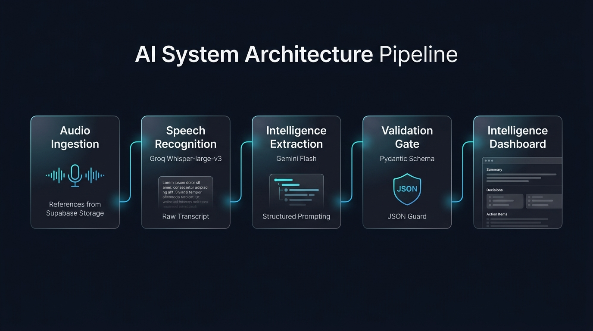

# AI Meeting Intelligence & Summarization Platform

> **Live Application**: [https://meeting-summarizer-app.netlify.app](https://meeting-summarizer-app.netlify.app)

An end-to-end AI application that converts meeting audio into structured meeting intelligence using **Groq Whisper**, **Google Gemini**, **FastAPI**, and **React**.

---

## Live Demo & Deliverables

- **Frontend App**: [https://meeting-summarizer-app.netlify.app](https://meeting-summarizer-app.netlify.app)
- **Demo Video**: [demo/demo-video.mp4](demo/demo-video.mp4)
- **Backend API**: Hosted on Render
- **Database & Storage**: Supabase

---

## Features

- **Audio Upload & Live Recording**: Upload audio files or record directly via browser microphone.
- **Speech-to-Text**: Fast transcription powered by Groq Whisper (`whisper-large-v3`).
- **Structured Intelligence**: Google Gemini extracts executive summaries, key discussion points, explicit decisions, and verified action items.
- **Pydantic Validation**: Strict schema enforcement to prevent hallucination.
- **Interactive Dashboard**: Searchable transcript, action items checklist, Markdown export, and latency telemetry.

---

## Architecture



```text
Audio / Live Mic ──► FastAPI ──► Supabase Storage
                         │
                         ▼
             Groq Whisper (ASR) ──► Transcript
                                         │
                                         ▼
             Gemini (LLM) ───────► Structured Intelligence
                                         │
                                         ▼
                                   React Dashboard
```

---

## Technology Stack

- **Frontend**: React, Vite, Tailwind CSS
- **Backend**: Python, FastAPI, Pydantic
- **Speech-to-Text**: Groq Whisper (`whisper-large-v3`)
- **LLM**: Google Gemini
- **Database & Storage**: Supabase (PostgreSQL & Storage)

---

## API Endpoints

| Method | Endpoint | Description |
| :--- | :--- | :--- |
| `GET` | `/health` | Health check |
| `POST` | `/api/meetings/upload` | Upload audio and create meeting record |
| `GET` | `/api/meetings/{id}/status` | Get real-time processing status |
| `GET` | `/api/meetings/{id}` | Get complete transcript and summary |

---

## Local Setup

### 1. Backend Setup
```bash
cd backend
python -m venv .venv
source .venv/bin/activate  # On Windows: .venv\Scripts\activate
pip install -r requirements.txt
cp .env.example .env
uvicorn app.main:app --reload --port 8000
```

### 2. Frontend Setup
```bash
cd frontend
npm install
cp .env.example .env
npm run dev
```
